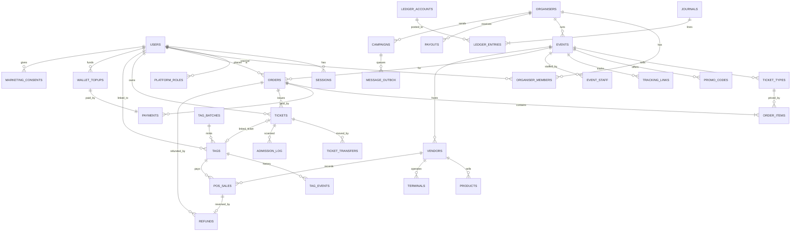

# Architecture

## Shape

A **modular monolith**: one Node.js 22 / Express 4 process and one PostgreSQL 16 database. Background jobs run in the same process and can be switched off with `WORKERS=false` so they run in a separate copy instead. There is no build step for the front end. Browser code is plain ES modules served as static files, the same way TitoPay ships.

```
                         ticketroom.co.za (TLS at proxy / Cloudflare)
                                        │
          ┌─────────────────────────────┼──────────────────────────────┐
          │  Express app (server.js → src/app.js)                      │
          │  securityHeaders · cookies · session · CSRF · rate limits  │
          │                                                            │
          │  routes/        public · auth · account · organiser ·      │
          │                 staff · pos · admin · webhooks · sim       │
          │  modules/       orders · payments(+providers) · tickets ·  │
          │                 tags · cashless · pos · finance(refunds,   │
          │                 settlements, reconciliation) · marketing · │
          │                 messaging(outbox)                          │
          │  lib/           db(tx/retry) · ledger · audit · crypto ·   │
          │                 money · validate · ratelimit · errors      │
          │  workers.js     order expiry · outbox · campaigns ·        │
          │                 event/tag/transfer expiry · retention      │
          └───────────────┬───────────────────────────┬────────────────┘
                          │                           │ hosted checkout + signed webhooks
                   PostgreSQL 16                Payment provider adapter
            schemas: tr · tr_meta · sim_provider     (SIMULATED today)
```

### Portals (all served by the same app)

| Path | Audience | File |
|---|---|---|
| `/` `/events/:slug` `/orders/:ref` `/organisers` `/help` `/legal/*` | Public, buyers | `public/assets/site.js` |
| `/account` | Attendees: tickets, transfers, tags, cashless, refunds, privacy | `account.js` |
| `/organisers` | Organisers: events, pricing, promos, analytics, staff, vendors, marketing, finance | `organiser.js` |
| `/scan` | Event staff: gate scanning and the tag desk | `scan.js` |
| `/pos` | Vendor cashiers and managers | `pos.js` |
| `/admin` | TicketRoom admin, finance and support | `admin.js` |

## Module responsibilities and data ownership

| Module | Owns (tables) | Responsibility |
|---|---|---|
| auth (`routes/auth.js`) | users, sessions, password_resets, platform_roles | Registration, login and lockout, sessions, CSRF tokens, PIN, POPIA export and delete |
| organisers (`routes/organiser.js`) | organisers, organiser_members, uploads | Organiser onboarding, team roles, bank details (encrypted) |
| events / inventory | events, ticket_types, promo_codes, tracking_links | Listings, lifecycle, capacity, pricing, promotions |
| orders (`modules/orders`) | orders, order_items | Quoting (server prices only), atomic holds, expiry, fulfilment |
| payments (`modules/payments`) | payments, webhook_events | Provider adapters, webhook verification and dedup, status sync |
| tickets (`modules/tickets`) | tickets, ticket_transfers, admission_log, event_staff | Issuance, signed QR, transfer, reissue and revoke, admission |
| tags (`modules/tags`) | tag_batches, tags, tag_events | Registry, linking, lost/block/replace, reader-input normalisation |
| cashless (`modules/cashless`) | wallet_topups | Mode A top-ups and balances (balances live in the ledger) |
| pos (`modules/pos`) | vendors, vendor_members, products, terminals, pos_sales, pos_sale_items | Terminal identity, charges, idempotency, PIN checks |
| finance (`modules/finance`) | refunds, refund_tickets, payouts, reconciliation_runs/items | Maker-checker refunds and payouts, reconciliation |
| ledger (`lib/ledger.js`) | ledger_accounts, journals, ledger_entries | Double-entry postings, locked balances, reversals |
| marketing (`modules/marketing`) | marketing_consents, consent_log, campaigns | Consent, audiences, campaigns, analytics |
| messaging (`modules/messaging`) | message_outbox | Transactional outbox, delivery adapters |
| audit (`lib/audit.js`) | audit_log | Hash-chained, append-only audit trail |
| support | support_cases | Customer cases |

A module writes only to its own tables. The few cross-module writes (for example, fulfilment issuing tickets) are direct calls inside the **same database transaction**, so a payment confirmation, its tickets and its journal commit together or not at all.

## Entity-relationship diagram (core)



Constraints that carry business rules (see the migrations for all of them):

* `ticket_types_no_oversell CHECK (quantity_sold + quantity_held <= quantity_total)`
* `orders CHECK (total = subtotal − discount + fee)` and `refunded ≤ total`
* `tickets.code UNIQUE` (random; never the database id)
* `tags.token_hash UNIQUE`, plus a partial unique index allowing **one active tag per attendee per event** and one per ticket
* `payments (provider, provider_reference) UNIQUE`, `webhook_events (provider, provider_event_id) UNIQUE`
* `pos_sales (terminal_id, idempotency_key) UNIQUE`, `journals.idempotency_key UNIQUE`
* `refunds CHECK (decided_by <> requested_by)`, `payouts CHECK (approved_by <> requested_by)` (maker-checker enforced in the database)
* A deferred constraint trigger: every journal sums to 0 with ≥ 2 lines. Triggers make `journals`, `ledger_entries`, `audit_log`, `admission_log`, `tag_events` and `consent_log` append-only.
* `ticket_transfers` allows one pending transfer per ticket. `payouts` allows one open payout per beneficiary.

## Order and ticket lifecycle

```
            ┌──────────── cancel (buyer) ───────────► cancelled
 create ──► pending_payment ── expiry sweep (after asking provider) ──► expired
            │                                                │ late "paid" webhook
            │ verified "paid"                                ▼
            ▼                                     stock left? ── yes ──► paid
           paid ── refund (partial) ──► partially_refunded ──► refunded
                                                  no ──► paid_unfulfilled ──► (auto refund raised) ──► refunded

 ticket:  valid ──scan──► used        valid ──refund──► refunded       valid ──admin──► revoked
          valid ──transfer accepted / reissue──► valid (qr_version + 1: every old QR is dead)
```

## Tag-linking flow

```mermaid
sequenceDiagram
  autonumber
  participant Admin
  participant TR as TicketRoom
  participant Att as Attendee
  participant Desk as Desk staff
  Admin->>TR: create batch (generate tokens | import chip UIDs)
  TR-->>Admin: CSV once: payload, display code, activation code (raw values never stored)
  Note over Admin: Print QR / encode NDEF; activation code goes under a scratch panel
  alt Self-service
    Att->>TR: link(display code, activation code, event)
    TR->>TR: verify activation (scrypt), require ticket for event, lock row, one active tag per person/event
  else Registration desk
    Desk->>TR: scan ticket QR + tap/scan tag
    TR->>TR: verify ticket signature/version, link tag to ticket owner
  end
  TR-->>Att: tag active
  Att->>TR: report lost → status lost (immediate; blocks POS and gate)
  Desk->>TR: replace(old tag, new tag) → old = replaced, new = active, same person + ticket
```

Status transitions: `unassigned → assigned (batch has event) → active → blocked ⇄ active | lost | revoked | replaced | expired`.

## Concurrency strategy

| Hazard | Control |
|---|---|
| Overselling | `SELECT … FOR UPDATE` on the event row (capacity) **and** a conditional `UPDATE ticket_types … WHERE sold+held+n ≤ total`, backed by a CHECK constraint |
| Double admission | One statement: `UPDATE tickets SET status='used' WHERE id=$1 AND status='valid' RETURNING` |
| Overdraft | `SELECT … FOR UPDATE` on the attendee's ledger account row, then the balance read, then posting, all in one transaction |
| Duplicate charge | Unique `(terminal, idempotency_key)`. A concurrent duplicate loses on the unique index and is answered with the winner's result. |
| Duplicate webhook | Unique `(provider, event_id)`, the payment row locked, and state checks making confirmation a no-op the second time |
| Deadlock / serialisation failure | `withTx` retries `40P01` / `40001` up to three times. Every financial operation is written to be safe to re-run. |

## Why not reuse TitoPay services now

TitoPay's API, wallet ledger and provider adapters are not in this repository. Wiring TicketRoom into them blind would break the brief's first rule. The provider adapter interface (`modules/payments/providers/index.js`) is the seam: a `titopay` adapter can call TitoPay's payment API once its contract is shared. TicketRoom's ledger then records the result without touching TitoPay's.
