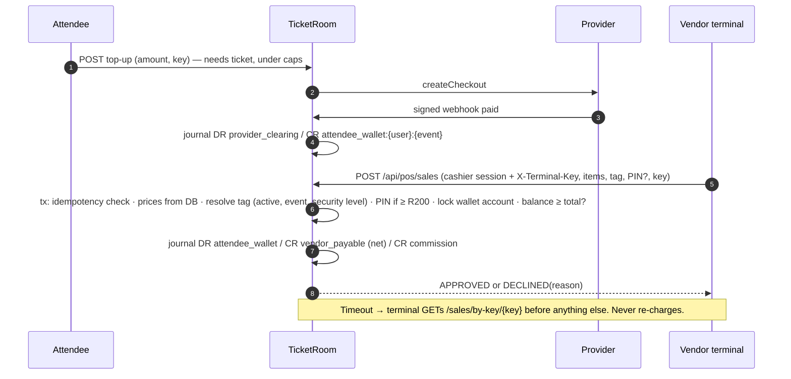

# Payments, cashless and the ledger

> **Status: SIMULATED.** The only installed provider adapter is `simulated`. It behaves like a hosted-checkout provider: TicketRoom redirects the buyer to a page the provider owns, and the provider keeps its own records and sends signed webhooks. **No real money moves.** Production refuses to start with it unless `ALLOW_SIMULATED_PROVIDER=true` is set.

## Provider adapter contract (`src/modules/payments/providers/index.js`)

| Operation | Purpose | Simulated |
|---|---|---|
| `createCheckout({payment, returnUrl, notifyUrl})` | Hosted payment page | Yes |
| `fetchStatus(ref)` | Ask the provider directly (expiry, admin re-check, reconciliation) | Yes |
| `verifyWebhook(raw, headers)` | Authenticate the notification | HMAC-SHA256 over `t.raw`, 300 s tolerance |
| `refund({ref, amount, idempotencyKey})` | Provider refund. **Must be idempotent.** | Yes (idempotency key enforced) |
| `settlementReport({from, to})` | Daily reconciliation input | Yes. A CSV upload is also supported. |

To add a real provider, implement only the operations the provider documents. Map its statuses to `paid | pending | failed | cancelled`. Register it in `registry`. Run the full test suite against its sandbox with `PAYMENT_PROVIDER=<name>`. Then repeat the scenarios in `PILOT-ACCEPTANCE.md`.

## Ticket purchase

```mermaid
sequenceDiagram
  autonumber
  participant B as Buyer (browser)
  participant TR as TicketRoom
  participant P as Provider
  B->>TR: POST /api/public/orders (items, idempotencyKey)
  TR->>TR: tx: lock event, price from DB, hold inventory, order=pending_payment, payment=initiated
  TR->>P: createCheckout(amount, notifyUrl)
  P-->>TR: providerReference, redirectUrl
  TR-->>B: redirectUrl
  B->>P: pays on hosted page
  P-->>B: redirect to /orders/:ref (shows "confirming…", NOT paid)
  P->>TR: webhook (signed)
  TR->>TR: verify sig + timestamp, store event (unique id), lock payment
  TR->>TR: amount == expected? → confirm; tx: holds→sold, issue tickets, post journal, queue email
  B->>TR: polls order → paid, tickets shown
  Note over TR,P: No webhook? Expiry sweep calls fetchStatus before releasing stock.
```

## Cashless Mode A: top-up and spend



Offline cashless spending is **not supported**: the POS disables charging when offline. Offline ticket admission is also not built (see `LIMITATIONS.md`).

## Transaction states

* **payments:** `initiated → pending → confirmed → partially_refunded → refunded`. Also `pending → failed | cancelled`. A confirmed payment never goes back to failed. A conflicting late "failed" is recorded in the audit log and ignored.
* **pos_sales:** `confirmed | declined` at creation. `confirmed → reversed` only through an approved refund.
* **refunds:** `requested → approved → processing → completed | failed (→ processing on retry)`, or `requested → rejected`.
* **payouts:** `requested → approved → paid`, or `requested → rejected`.

No client request can set any of these states directly.

## Ledger

Integer cents, ZAR only. Debits are positive and credits negative. Every journal sums to 0 (checked by a deferred trigger at commit). Rows are immutable (triggers). Corrections are reversal journals linked through `reverses_journal_id`. Each journal carries a unique `idempotency_key`, so re-posting the same business event returns the original journal.

### Chart of accounts

| Code | Kind | Meaning |
|---|---|---|
| `provider_clearing:{provider}` | asset | Money the provider holds for TitoPay |
| `platform_bank` | asset | TitoPay settlement bank account (credited when payouts are paid) |
| `organiser_payable:{org}:{event}` | liability | Ticket revenue owed to the organiser, per event |
| `vendor_payable:{vendor}` | liability | Cashless sales owed to a vendor |
| `attendee_wallet:{user}:{event}` | liability | Prepaid balance owed to the attendee |
| `platform_fee_revenue` | revenue | Buyer service fees |
| `platform_commission_revenue` | revenue | Vendor commission |
| `provider_fee_expense:{provider}` | expense | Reserved for provider fees from settlement reports |

### Postings

| Event | Debit | Credit |
|---|---|---|
| Ticket order paid | provider_clearing (total) | organiser_payable (subtotal − discount), platform_fee_revenue (fees) |
| Top-up confirmed | provider_clearing | attendee_wallet |
| POS sale | attendee_wallet (total) | vendor_payable (total − commission), platform_commission_revenue |
| Ticket refund | organiser_payable (ticket part), platform_fee_revenue (fee part if refunded) | provider_clearing |
| POS refund | Exact reversal of the sale journal | |
| Unused-balance refund | attendee_wallet | provider_clearing (per funding top-up) |
| Payout recorded | organiser_payable per releasable event (oldest first) or vendor_payable | platform_bank |

### Integrity checks (`/api/admin/dashboard`, `/api/admin/reconciliation`)

* The sum of all entries is 0 and no journal is unbalanced.
* For each provider, `provider_clearing` equals confirmed payments − refunds (+ recorded settlements).
* The audit chain verifies.

## Reconciliation

A daily (or on-demand) run compares the provider report (pulled from the API or uploaded as CSV) with `payments` for the period. Every row becomes `matched | amount_mismatch | status_mismatch | missing_internal | missing_provider`. Exceptions stay open until finance resolves them **with a note**. Nothing is auto-corrected. The tests inject every kind of discrepancy.

## Refunds and payouts: who can do what

* **Ticket refunds:** the organiser owner or finance member (or an admin cancelling the event) requests one. **Platform finance** approves it, and the approver cannot be the requester. The provider refund uses idempotency key `refund:{id}`, so a retry never pays twice.
* **POS refunds:** a cashier or manager requests one. The organiser owner/manager or platform finance approves it. It is processed as a ledger reversal.
* **Unused balance:** the attendee requests it. Platform finance approves it. It is paid back to the funding top-ups, newest first, capped at the live balance.
* **Payouts:** the organiser owner or finance member requests one, up to the *available* balance (event ended + hold days, cancelled events excluded, open refunds held back). Platform finance approves it (not the requester), then makes the EFT **outside the system** and records the bank reference. That posting debits the payable accounts. **TicketRoom never initiates a bank transfer itself.**
